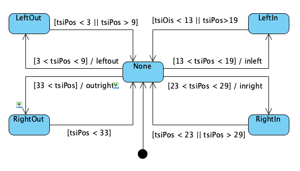

# Given code for lab 6

Poll touch pad and write the distance to the terminal.

Two threads are used.
 1. Thread to poll the touch pad distance and write the distance to the terminal
 2. Thread to turn the blue LED on for 5 sec when the touch pad distance is 20

 One activity of the lab is create 4 soft keys on the touch pad using the
 following state transition logic:

 
